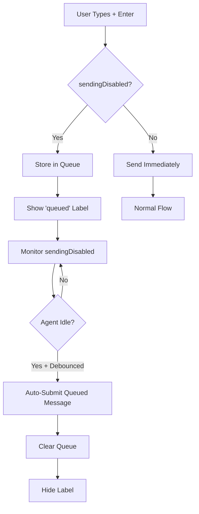

# Queued Messages Feature Implementation Plan

## Current Architecture Understanding

From my analysis, I've identified the key components and flow:

1. **ChatTextArea.tsx** - The main text input component with send functionality
2. **ChatView.tsx** - Parent component that manages message sending via `handleSendMessage`
3. **ExtensionStateContext.tsx** - Global state management
4. **Message Flow**: User input → `handleSendMessage` → `vscode.postMessage` → Extension backend
5. **Send Button State**: Controlled by `sendingDisabled` prop from ChatView

## Implementation Plan

### Phase 1: State Management Infrastructure

**1.1 Add Queued Message State**

- Add `queuedMessage` and `queuedImages` state to ChatView component
- Add `hasQueuedMessage` computed state
- Add `clearQueuedMessage` function

**1.2 Queue Detection Logic**

- Modify ChatTextArea's `onSend` handler to check if `sendingDisabled` is true
- If disabled, store message in queue instead of sending
- Clear input after queuing

### Phase 2: UI Enhancements

**2.1 Queued Message Indicator**

- Add "queued" label in upper-right corner of ChatTextArea
- Position absolutely with CSS
- Show only when `hasQueuedMessage` is true
- Style consistently with existing UI theme

**2.2 Visual State Changes**

- Modify ChatTextArea styling when message is queued
- Consider subtle background color change or border indicator

### Phase 3: Auto-Submit Logic

**3.1 Send Button State Monitoring**

- Create custom hook `useQueuedMessageAutoSubmit`
- Monitor `sendingDisabled` state changes
- Implement debounced detection of "idle" state (send button enabled for X milliseconds)

**3.2 Auto-Submit Implementation**

- When agent becomes idle and queue has message, auto-trigger `handleSendMessage`
- Clear queued message after successful submission
- Handle edge cases (user types new message while queued message exists)

### Phase 4: Edge Case Handling

**4.1 Queue Management**

- Only allow one queued message at a time
- If user types new message while one is queued, replace the queued message
- Clear queue when user manually starts new task

**4.2 State Synchronization**

- Ensure queued message persists across component re-renders
- Handle cleanup when component unmounts

## Detailed Implementation Locations

### Files to Modify:

1. **webview-ui/src/components/chat/ChatView.tsx**

    - Add queued message state variables
    - Modify message sending logic to handle queuing
    - Add auto-submit logic

2. **webview-ui/src/components/chat/ChatTextArea.tsx**

    - Add queued message UI indicator
    - Modify onSend prop handling
    - Add CSS for queued state styling

3. **webview-ui/src/components/chat/hooks/** (new file)
    - Create `useQueuedMessageAutoSubmit.ts` hook
    - Encapsulate auto-submit logic and timing

### Key Implementation Details:

**Queue Storage Location**: ChatView component state (not global context to keep isolated)

**Auto-Submit Timing**:

- Monitor `sendingDisabled` state
- Use debounced effect with ~500ms delay after send button becomes enabled
- Only trigger if queued message exists

**UI Positioning**:

- Absolute positioned "queued" label in ChatTextArea container
- Upper-right corner, small font, themed styling
- Z-index to ensure visibility over other elements

**Message Flow**:

```
User types + Enter → Check sendingDisabled →
If disabled: Store in queue + Show indicator →
Monitor sendingDisabled → When enabled + debounced →
Auto-call handleSendMessage with queued content
```

## Benefits of This Approach:

1. **Isolated Implementation**: All changes contained within webview components
2. **Minimal Cross-Boundary Communication**: No new message types to extension
3. **Consistent UX**: Reuses existing message sending infrastructure
4. **Maintainable**: Clear separation of concerns with custom hook
5. **Robust**: Handles edge cases and state synchronization

## Architecture Diagram



## Debug Strategy:

All debug console logs will use distinctive emoji prefixes for easy filtering:

- 🔄 Queue state changes (queue created, cleared, replaced)
- 📥 Message routing decisions (queued vs sent immediately)
- ⏱️ Idle detection and timing (debounce start/end, state monitoring)
- 🚀 Auto-submit execution (trigger conditions met, message sent)

These debug logs will be removed once the feature is confirmed working properly.

### Phase 5: Playwright E2E Testing

**5.1 Test File Creation**

- Create `apps/playwright-e2e/tests/queued-messages.test.ts`
- Follow existing test patterns from `chat-with-response.test.ts`
- Use established helper functions for webview interaction

**5.2 Core Behavior Tests**

**Test 1: Message Queuing When Agent Busy**

```typescript
test("should queue message when agent is processing", async ({ workbox: page }) => {
	// Setup: Configure extension
	// Action: Send first message (agent becomes busy immediately)
	// Action: Quickly send second message while first is still processing
	// Assert: Second message shows "queued" indicator, doesn't send immediately
})
```

**Test 2: Queued Message UI Indicator**

```typescript
test("should display queued indicator in chat input", async ({ workbox: page }) => {
	// Setup: Send first message to make agent busy
	// Action: Send second message immediately (gets queued)
	// Assert: "queued" label visible in upper-right corner of ChatTextArea
	// Assert: Chat input styling changes to indicate queued state
})
```

**Test 3: Auto-Submit When Agent Becomes Idle**

```typescript
test("should auto-submit queued message when agent finishes", async ({ workbox: page }) => {
	// Setup: Send first message, then immediately send second (gets queued)
	// Wait: For first message response to complete and agent to become idle
	// Assert: Queued message automatically submits after ~500ms debounce
	// Assert: Queued indicator disappears
	// Assert: Agent processes the queued message and responds
})
```

**5.3 Edge Case Tests**

**Test 4: Queue Replacement**

```typescript
test("should replace queued message with new input", async ({ workbox: page }) => {
	// Setup: Send first message, then second (gets queued)
	// Action: Type and submit third message while second still queued
	// Assert: Second message gets replaced by third in queue
	// Assert: Only third message auto-submits when agent becomes idle
})
```

**Test 5: Queue Clearing**

```typescript
test("should clear queue when user starts new task", async ({ workbox: page }) => {
	// Setup: Send first message, then second (gets queued)
	// Action: Manually start new task/conversation
	// Assert: Queued message is cleared and doesn't auto-submit
})
```

**Test 6: Multiple Queue Attempts**

```typescript
test("should only allow one queued message at a time", async ({ workbox: page }) => {
	// Setup: Send first message, then multiple messages in quick succession
	// Assert: Only latest message remains in queue
	// Assert: Single "queued" indicator shown
})
```

**5.4 Integration with Existing Test Infrastructure**

**Test Setup Helpers** (leverage existing patterns):

```typescript
// Use existing helpers from webview-helpers.ts
await verifyExtensionInstalled(page)
await upsertApiConfiguration(page)
const webviewFrame = await findWebview(page)
const chatInput = webviewFrame.locator('textarea, input[type="text"]').first()
```

**Custom Test Helpers** (new helpers needed):

```typescript
async function sendMessageQuickly(chatInput, message) {
	// Send a message without waiting for response
	await chatInput.fill(message)
	await chatInput.press("Enter")
}

async function waitForQueuedIndicator(webviewFrame, shouldBeVisible = true) {
	// Wait for "queued" label to appear/disappear in ChatTextArea
	const queuedLabel = webviewFrame.locator('[data-testid="queued-indicator"]')
	if (shouldBeVisible) {
		await queuedLabel.waitFor({ state: "visible", timeout: 5000 })
	} else {
		await queuedLabel.waitFor({ state: "hidden", timeout: 5000 })
	}
}

async function waitForAgentIdle(webviewFrame) {
	// Wait for send button to be enabled (sendingDisabled = false)
	// Include debounce timing (~500ms) to ensure auto-submit triggers
	const sendButton = webviewFrame.locator('[data-testid="send-button"]')
	await sendButton.waitFor({ state: "enabled", timeout: 15000 })
	await page.waitForTimeout(600) // Debounce + buffer
}
```

**5.5 Test Data Requirements**

- **Test Messages**: Use simple, predictable prompts for consistent timing
- **Agent Response Time**: Design first message to have known processing duration
- **Timeout Values**: Set appropriate timeouts for auto-submit testing (~10-15 seconds)

**5.6 Test Implementation Notes**

**UI Element Targeting**:

- Add `data-testid="queued-indicator"` to queued label for reliable selection
- Add `data-testid="send-button"` to send button for state monitoring
- Use existing textarea locator patterns from `chat-with-response.test.ts`

**Timing Considerations**:

- Account for 500ms debounce in auto-submit logic
- Allow sufficient timeout for agent processing (30s as in existing test)
- Use `page.waitForTimeout()` sparingly, prefer event-based waiting

**Test Organization**:

```typescript
test.describe("Queued Messages Feature", () => {
	test.beforeEach(async ({ workbox: page }) => {
		await verifyExtensionInstalled(page)
		await waitForWebviewText(page, "Welcome to Kilo Code!")
		await upsertApiConfiguration(page)
	})

	test.describe("Core Functionality", () => {
		// Tests 1-3: Basic queuing, indicator, auto-submit
	})

	test.describe("Edge Cases", () => {
		// Tests 4-6: Replacement, clearing, multiple attempts
	})
})
```

**5.7 Success Criteria for Testing Phase**

✅ All 6 test scenarios pass consistently
✅ Tests run in reasonable time (< 5 minutes total)
✅ Tests are deterministic and don't produce false positives
✅ Test coverage includes both happy path and edge cases
✅ Tests validate both functional behavior and UI feedback
✅ Integration with existing Playwright infrastructure works smoothly

## Next Steps:

1. Confirm this architectural approach aligns with requirements
2. Implement Phase 1 (state management) with debug logging
3. Add Phase 2 (UI enhancements)
4. Implement Phase 3 (auto-submit logic) with timing debug logs
5. Test and refine Phase 4 (edge cases)
6. **Implement Phase 5 (Playwright E2E tests) to validate entire feature**
7. Remove debug console logs once feature is stable

This plan ensures the feature integrates seamlessly with the existing architecture while maintaining code quality and user experience standards. The comprehensive testing phase provides confidence that all queued message behaviors work correctly in real-world usage scenarios.
