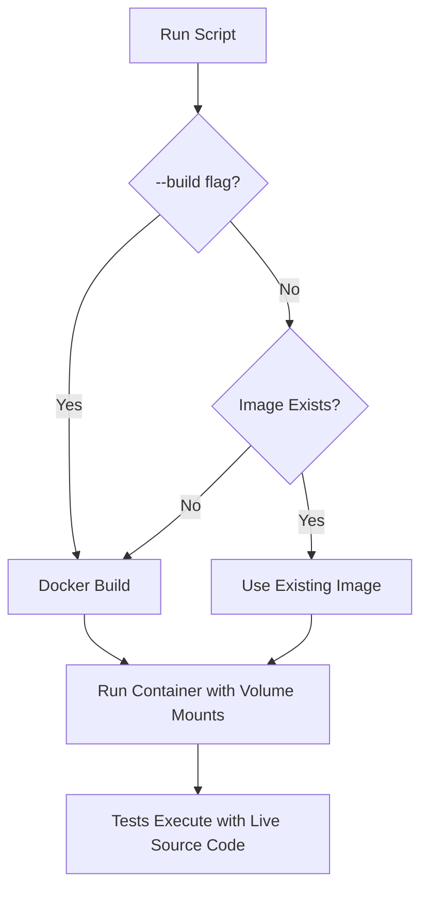

# Docker Volume Mount Optimization for Playwright CI

## Overview

This optimization eliminates the need to rebuild the Docker image for every source code change by using volume mounts to overlay live source code while preserving built dependencies.

## How It Works

### Build Time (Slower, Less Frequent)

1. **Docker Build**: [`Dockerfile.playwright-ci`](../Dockerfile.playwright-ci) copies source code and builds dependencies
2. **Dependency Installation**: `node_modules` are installed and webview is built inside the image
3. **Image Creation**: Complete Docker image with all dependencies ready

### Runtime (Fast, Every Test Run)

1. **Volume Mount**: Host source code is mounted to `/workspace` in the container
2. **Dependency Preservation**: Built `node_modules` are preserved via anonymous volume
3. **Live Updates**: Source code changes are immediately available in the container

## Volume Mount Strategy

```bash
docker run --rm \
    -v "$(pwd):/workspace" \        # Mount entire host directory
    -v "/workspace/node_modules" \  # Anonymous volume preserves built dependencies
    # ... other options
    playwright-ci-sim
```

## Usage

### Fast Development Workflow (Recommended)

```bash
# First time or when dependencies change
./run-playwright-ci-simulation.sh --build

# Subsequent runs (fast - uses existing image)
./run-playwright-ci-simulation.sh
```

### Command Options

| Command                                       | Description             | Speed   | When to Use                                        |
| --------------------------------------------- | ----------------------- | ------- | -------------------------------------------------- |
| `./run-playwright-ci-simulation.sh`           | Run with existing image | ⚡ Fast | Regular development, source code changes           |
| `./run-playwright-ci-simulation.sh --build`   | Rebuild image and run   | 🐌 Slow | First time, dependency changes, Dockerfile changes |
| `./run-playwright-ci-simulation.sh --rebuild` | Same as `--build`       | 🐌 Slow | Alias for `--build`                                |
| `./run-playwright-ci-simulation.sh --help`    | Show help               | -       | Get usage information                              |

### Key Benefits

- **🚀 Fast Iteration**: No Docker rebuild for source code changes (seconds vs minutes)
- **💾 Dependency Stability**: `node_modules` built in controlled environment
- **🔄 Live Updates**: Code changes reflect immediately in container
- **📦 Smaller Rebuilds**: Only rebuild when dependencies actually change
- **🛡️ Safety**: Prevents accidental slow rebuilds with explicit `--build` flag

## Technical Details

### Volume Mount Configuration

- **Source Code Mount**: `$(pwd):/workspace` - Overlays entire host directory
- **Dependency Preservation**: `/workspace/node_modules` - Anonymous volume preserves built dependencies
- **File Permissions**: Proper UID/GID mapping maintained via `vscode` user

### Build vs Runtime Behavior



### Directory Structure in Container

```
/workspace/
├── node_modules/          # From Docker image (preserved via anonymous volume)
├── src/                   # From host mount (live)
├── webview-ui/           # From host mount (live)
├── apps/                 # From host mount (live)
├── packages/             # From host mount (live)
├── dist/                 # From Docker image (built, may be overwritten)
└── out/                  # From Docker image (built, may be overwritten)

/usr/local/bin/
└── run-tests.sh          # Entry script (protected from volume mount)
```

## Migration from Old Workflow

### Before (Always Rebuild)

```bash
# Every run required full rebuild (slow)
./run-playwright-ci-simulation.sh
```

### After (Smart Rebuild)

```bash
# First time or dependency changes
./run-playwright-ci-simulation.sh --build

# Regular development (fast)
./run-playwright-ci-simulation.sh
```

## Troubleshooting

### Image Not Found Error

If you get "image not found" errors, the script will automatically build the image:

```bash
# This will auto-build if image doesn't exist
./run-playwright-ci-simulation.sh
```

### Force Rebuild

To force a complete rebuild (e.g., after Dockerfile changes):

```bash
./run-playwright-ci-simulation.sh --build
```

### Dependency Issues

If you encounter dependency-related issues, rebuild the image:

```bash
./run-playwright-ci-simulation.sh --build
```

## Performance Comparison

| Scenario           | Old Workflow  | New Workflow  | Time Saved |
| ------------------ | ------------- | ------------- | ---------- |
| First run          | ~5-10 minutes | ~5-10 minutes | None       |
| Source code change | ~5-10 minutes | ~30 seconds   | 90%+       |
| Dependency change  | ~5-10 minutes | ~5-10 minutes | None       |
| Regular testing    | ~5-10 minutes | ~30 seconds   | 90%+       |

## Best Practices

1. **Use `--build` sparingly**: Only when dependencies or Dockerfile change
2. **Regular development**: Use without flags for fast iteration
3. **CI/CD**: Always use `--build` in CI environments for consistency
4. **Team workflow**: Document when team members should use `--build`

## Implementation Files

- [`run-playwright-ci-simulation.sh`](../run-playwright-ci-simulation.sh) - Main script with flag support
- [`Dockerfile.playwright-ci`](../Dockerfile.playwright-ci) - Docker image definition (unchanged)
- [`chrome-seccomp.json`](../chrome-seccomp.json) - Chrome sandbox security profile
