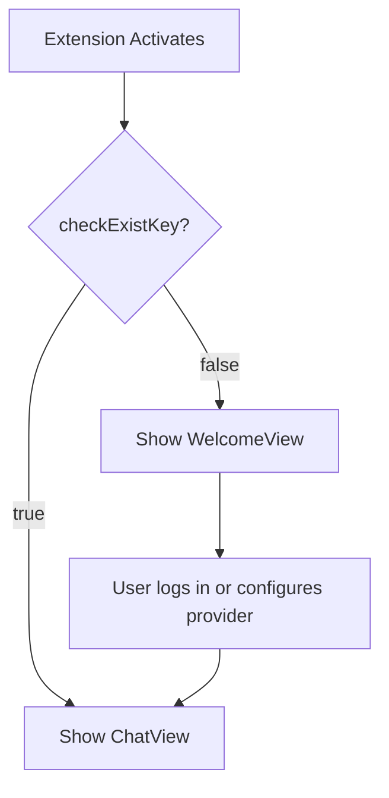
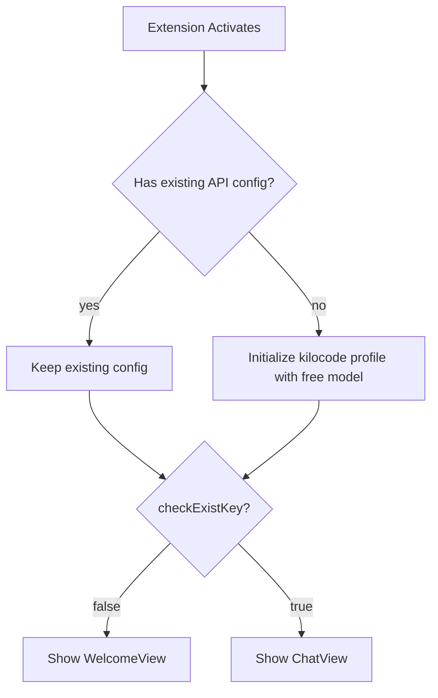

# Anonymous Kilo Code Gateway Onboarding Plan

## Overview

This plan outlines the changes needed to allow users to skip the welcome/onboarding screen and go directly to the chat window with a default Kilo Code Gateway profile using a free model (ending in `:free`).

**Key Principle:** Only initialize the default kilocode profile for users who have NO existing API configuration. Users with existing profiles/keys are not affected.

## Current Flow



### Key Components

1. **showWelcome determination** - In [`ExtensionStateContext.tsx:411`](webview-ui/src/context/ExtensionStateContext.tsx:411):

    ```typescript
    setShowWelcome(!checkExistKey(newState.apiConfiguration))
    ```

2. **checkExistKey function** - In [`checkExistApiConfig.ts`](src/shared/checkExistApiConfig.ts):

    - Returns `true` if provider has valid API keys/configuration
    - Currently checks for `kilocodeModel` but NOT `apiProvider: "kilocode"` alone

3. **KiloCode provider** - In [`kilocode-openrouter.ts`](src/api/providers/kilocode-openrouter.ts):

    - Requires `kilocodeToken` for `fetchModel()` - throws error if missing
    - Uses `getKiloUrlFromToken()` which defaults to `https://api.kilo.ai` when no token

4. **Default profile initialization** - In [`ProviderSettingsManager.ts`](src/core/config/ProviderSettingsManager.ts):
    - Creates empty default profile: `{ id: this.defaultConfigId }`
    - No provider or model is pre-configured

## Proposed Flow



## Who Gets the Default Kilocode Profile?

| User Type                         | Has API Key? | Has Provider Config? | Action                              |
| --------------------------------- | ------------ | -------------------- | ----------------------------------- |
| New install                       | No           | No                   | Initialize kilocode with free model |
| Existing user with kilocode token | Yes          | Yes                  | Keep existing config                |
| Existing user with other provider | Yes/No       | Yes                  | Keep existing config                |
| User who reset settings           | No           | No                   | Initialize kilocode with free model |

## Implementation Tasks

### 1. Backend: Support Anonymous Requests in KiloCode Handler

**File:** [`src/api/providers/kilocode-openrouter.ts`](src/api/providers/kilocode-openrouter.ts)

**Changes:**

- Remove the token requirement check in `fetchModel()` (line 123-124)
- Allow API calls without `Authorization` header when no token is provided
- The backend already supports anonymous requests, so this is just removing the client-side guard

```typescript
// Before (line 123-124):
if (!this.options.kilocodeToken || !this.options.openRouterBaseUrl) {
	throw new Error(KILOCODE_TOKEN_REQUIRED_ERROR)
}

// After:
if (!this.options.openRouterBaseUrl) {
	throw new Error("OpenRouter base URL is required")
}
```

### 2. Backend: Update Model Fetching for Anonymous Access

**File:** [`src/api/providers/fetchers/modelCache.ts`](src/api/providers/fetchers/modelCache.ts)

**Changes:**

- In `fetchModelsFromProvider()` case `kilocode` (lines 106-116), ensure it works without token
- The `getOpenRouterModels()` call already handles optional headers

```typescript
// Current (line 113):
headers: options.kilocodeToken ? { Authorization: `Bearer ${options.kilocodeToken}` } : undefined,

// This already works - no change needed here
```

### 3. Backend: Update Default Model Fetching for Anonymous Access

**File:** [`src/api/providers/kilocode/getKilocodeDefaultModel.ts`](src/api/providers/kilocode/getKilocodeDefaultModel.ts)

**Changes:**

- Modify `getKilocodeDefaultModel()` to fetch default model even without token
- Remove early return when no token (line 64-66)
- Make Authorization header optional in `fetchKilocodeDefaultModel()`

```typescript
// Before (line 64-66):
if (!kilocodeToken) {
	return openRouterDefaultModelId
}

// After:
// Remove this check - allow fetching without token

// Before (line 28-29):
const headers: Record<string, string> = {
	...DEFAULT_HEADERS,
	Authorization: `Bearer ${kilocodeToken}`,
}

// After:
const headers: Record<string, string> = {
	...DEFAULT_HEADERS,
}
if (kilocodeToken) {
	headers.Authorization = `Bearer ${kilocodeToken}`
}
```

### 4. Frontend: Update checkExistKey to Recognize KiloCode Provider

**File:** [`src/shared/checkExistApiConfig.ts`](src/shared/checkExistApiConfig.ts)

**Changes:**

- Add `kilocode` to the list of providers that don't need additional configuration
- This allows the chat view to show when `apiProvider: "kilocode"` is set with a model

```typescript
// Before (line 9-14):
if (
	config.apiProvider &&
	["human-relay", "fake-ai", "claude-code", "qwen-code", "roo", "gemini-cli"].includes(config.apiProvider)
) {
	return true
}

// After:
if (
	config.apiProvider &&
	["human-relay", "fake-ai", "claude-code", "qwen-code", "roo", "gemini-cli", "kilocode"].includes(config.apiProvider)
) {
	return true
}
```

### 5. Profile Initialization: Set Up Default KiloCode Profile (Migration-based)

**File:** [`src/core/config/ProviderSettingsManager.ts`](src/core/config/ProviderSettingsManager.ts)

**Changes:**

- Add a new migration that runs during `init_runMigrations()`
- Only set up kilocode profile if NO profile has a provider configured
- Use a hardcoded fallback free model if API fetch fails

**Fallback Free Model:** `google/gemma-2-9b-it:free`

#### 5.1 Update Migration Schema

Add `kilocodeDefaultProfileMigrated` to the migrations schema:

```typescript
// Update providerProfilesSchema migrations field (around line 46-57):
migrations: z
    .object({
        rateLimitSecondsMigrated: z.boolean().optional(),
        diffSettingsMigrated: z.boolean().optional(),
        openAiHeadersMigrated: z.boolean().optional(),
        consecutiveMistakeLimitMigrated: z.boolean().optional(),
        todoListEnabledMigrated: z.boolean().optional(),
        morphApiKeyMigrated: z.boolean().optional(),
        claudeCodeLegacySettingsMigrated: z.boolean().optional(),
        kilocodeDefaultProfileMigrated: z.boolean().optional(), // NEW
    })
    .optional(),
```

#### 5.2 Add Migration Logic

Add to `init_runMigrations()` after other migrations (around line 315):

```typescript
if (!providerProfiles.migrations?.kilocodeDefaultProfileMigrated) {
	await this.initializeKilocodeDefaultProfile(providerProfiles)
	providerProfiles.migrations = {
		...providerProfiles.migrations,
		kilocodeDefaultProfileMigrated: true,
	}
	isDirty = true
}
```

#### 5.3 Add New Private Method

```typescript
private async initializeKilocodeDefaultProfile(providerProfiles: ProviderProfiles): Promise<void> {
    const FALLBACK_FREE_MODEL = "google/gemma-2-9b-it:free"

    // Check if ANY profile has a configured provider
    const hasConfiguredProvider = Object.values(providerProfiles.apiConfigs).some(
        config => config.apiProvider !== undefined
    )

    // Only initialize if no profiles have a provider configured
    if (hasConfiguredProvider) {
        console.log("[ProviderSettingsManager] Skipping kilocode default - user has existing provider config")
        return
    }

    try {
        // Try to fetch models and find a free one
        const models = await getModels({ provider: "kilocode" })
        const freeModel = Object.keys(models).find(id => id.endsWith(":free")) || FALLBACK_FREE_MODEL

        // Update the default profile with kilocode provider
        const defaultConfig = providerProfiles.apiConfigs["default"]
        if (defaultConfig) {
            defaultConfig.apiProvider = "kilocode"
            defaultConfig.kilocodeModel = freeModel
            console.log(`[ProviderSettingsManager] Initialized default kilocode profile with model: ${freeModel}`)
        }
    } catch (error) {
        // Use fallback model if API fails
        console.error("[ProviderSettingsManager] Failed to fetch models, using fallback:", error)
        const defaultConfig = providerProfiles.apiConfigs["default"]
        if (defaultConfig) {
            defaultConfig.apiProvider = "kilocode"
            defaultConfig.kilocodeModel = FALLBACK_FREE_MODEL
            console.log(`[ProviderSettingsManager] Initialized default kilocode profile with fallback model: ${FALLBACK_FREE_MODEL}`)
        }
    }
}
```

#### 5.4 Add Import

Add import for `getModels` at the top of the file:

```typescript
import { getModels } from "../../api/providers/fetchers/modelCache"
```

## Testing Plan

### New User Flow

1. Install extension fresh (clear all extension data)
2. Verify extension goes directly to chat view (no welcome screen)
3. Verify default profile shows "Kilo Code" provider
4. Verify a free model is selected (ending in `:free`)
5. Send a test message and verify it works without authentication

### Existing User Flow

1. User with existing configuration should not be affected
2. User with existing kilocode token should continue to work
3. User who resets settings should get the new default profile

### Edge Cases

1. Network failure during model fetch - should use fallback model `google/gemma-2-9b-it:free`
2. No free models available from API - should use fallback model
3. Backend returns error - should use fallback model

## Rollback Plan

If issues arise:

1. Revert the `checkExistKey` change to remove kilocode from no-config-needed list
2. Revert the `fetchModel()` token requirement change
3. Users will see welcome screen again

## Files to Modify

| File                                                    | Change Type | Description                                   |
| ------------------------------------------------------- | ----------- | --------------------------------------------- |
| `src/api/providers/kilocode-openrouter.ts`              | Modify      | Remove token requirement in fetchModel        |
| `src/api/providers/kilocode/getKilocodeDefaultModel.ts` | Modify      | Support anonymous default model fetch         |
| `src/shared/checkExistApiConfig.ts`                     | Modify      | Add kilocode to no-config-needed providers    |
| `src/core/config/ProviderSettingsManager.ts`            | Modify      | Add migration to set default kilocode profile |

## Dependencies

- Backend must support anonymous requests to `/api/openrouter/models`
- Backend must support anonymous requests to `/api/defaults`
- Backend must return at least one model ending in `:free`

## Summary of Changes

1. **Remove token requirement** in `kilocode-openrouter.ts` - allows anonymous API calls
2. **Make auth header optional** in `getKilocodeDefaultModel.ts` - allows fetching default model without token
3. **Add kilocode to checkExistKey** - allows skipping welcome screen when kilocode is configured
4. **Add migration in ProviderSettingsManager** - automatically sets up kilocode profile for users without existing config
5. **Fallback model** - `google/gemma-2-9b-it:free` is used if API fetch fails
