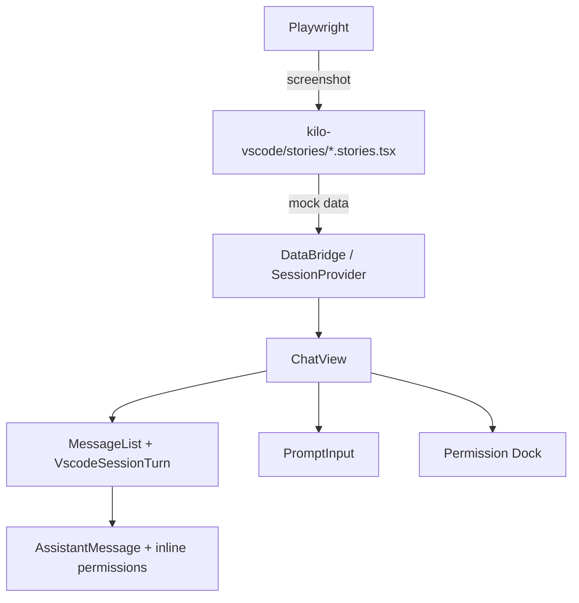

# Composite Webview Visual Regression Tests

## Problem

The VS Code extension's webview UI combines components from `kilo-ui` with extension-specific logic (context providers, tool overrides, inline permissions, session management). While `kilo-ui` has Storybook + Playwright visual regression tests for individual components, there's no testing of the **composed** UI — how these components look together in the actual extension webview context.

This gap allowed issues like:
- Permission prompts missing styling (no CSS for `permission-prompt` data attributes)
- Inline permissions rendering outside the tool card border
- Tool cards (glob, read) not showing input details during pending state

## Approach: Storybook Stories for Composite Extension Views

Reuse the existing kilo-ui Storybook infrastructure but add **composite stories** in `packages/kilo-vscode` that render the extension's actual components (ChatView, AssistantMessage, PromptInput etc.) with mock data — the same way `packages/kilo-ui/src/stories/message-part.stories.tsx` renders upstream message parts with mock providers.

### Why Storybook (not VS Code extension host tests)

- **Fast**: No VS Code process needed, just a browser
- **Deterministic**: Mock data, no real CLI backend or SSE connection
- **Reuses existing infra**: Same Playwright runner, same CI workflow pattern
- **VS Code theme support**: kilo-ui Storybook already has a `kilo-vscode` theme with real VS Code CSS variables

## Architecture



## Implementation Plan

### 1. Add Storybook to kilo-vscode

Add a `.storybook/` config under `packages/kilo-vscode/` that extends kilo-ui's Storybook config:

```
packages/kilo-vscode/
  .storybook/
    main.ts          ← stories from webview-ui/src/stories/
    preview.tsx       ← import kilo-ui styles + chat.css + kilo-vscode theme
  webview-ui/src/
    stories/
      chat-view.stories.tsx
      permission-inline.stories.tsx
      tool-cards.stories.tsx
```

The Storybook config uses `storybook-solidjs-vite` (same framework as kilo-ui) and resolves the same conditions.

### 2. Create Mock Providers

A `StoryProviders` wrapper that satisfies all the context requirements without a real CLI backend:

```tsx
function StoryProviders(props: { 
  session?: Partial<SessionContextValue>
  data?: any
  children: any 
}) {
  return (
    <DataProvider data={props.data ?? defaultMockData} directory="/project">
      <LanguageProvider locale="en">
        <SessionProvider mock={props.session}>
          {props.children}
        </SessionProvider>
      </LanguageProvider>
    </DataProvider>
  )
}
```

The `SessionProvider` needs a mock mode that accepts pre-configured state (permissions, questions, status) without connecting to a real server.

### 3. Composite Stories to Write

| Story | Tests |
|-------|-------|
| **Glob with permission** | Tool card shows `pattern=**/*.md` + inline deny/allow buttons |
| **Bash with permission** | Expanded bash card + command + inline permission |
| **Permission dock (no tool)** | Bottom dock with patterns + buttons |
| **Question dock** | Bottom question UI with options |
| **Chat idle** | Empty state with prompt input visible |
| **Chat busy** | Spinner, no prompt input |
| **Tool error** | Error card rendering |
| **Multiple tool calls** | Assistant message with read + glob + text parts |

### 4. Playwright Visual Regression

Same pattern as kilo-ui:

```ts
// packages/kilo-vscode/tests/visual-regression.spec.ts
const STORYBOOK_URL = "http://localhost:6007" // different port

const stories = await fetchStories()
for (const story of stories) {
  test(story.title + " / " + story.name, async ({ page }) => {
    await page.goto(iframeUrl(story.id, "kilo-vscode", "dark"))
    await disableAnimations(page)
    const root = page.locator("#storybook-root")
    await expect(root).toHaveScreenshot([component, variant + ".png"])
  })
}
```

### 5. CI Integration

Extend `.github/workflows/visual-regression.yml` to also trigger on `packages/kilo-vscode/webview-ui/**` changes and add a parallel job:

```yaml
visual-regression-vscode:
  name: Visual Regression (kilo-vscode webview)
  runs-on: blacksmith-4vcpu-ubuntu-2404
  steps:
    - # Same setup as kilo-ui job
    - name: Build Storybook
      run: bun run build-storybook
      working-directory: packages/kilo-vscode
    - name: Run visual regression
      run: bun run test:visual
      working-directory: packages/kilo-vscode
```

## Key Decisions

1. **Separate Storybook instance** rather than adding stories to kilo-ui — the extension's components depend on extension-specific contexts (SessionProvider, LanguageProvider) and styles (chat.css) that don't belong in the UI library

2. **Mock session context** rather than running a real CLI server — deterministic, fast, no side effects

3. **Use kilo-vscode theme by default** — screenshot the actual VS Code appearance since that's what users see

4. **Test at the composite level** — individual components are already tested in kilo-ui; we test the composition: ChatView with permission prompts, tool cards with inline buttons, etc.

## Estimated Effort

- Storybook setup: ~2h (config, build script, mock providers)
- Initial stories (8 scenarios): ~4h
- Playwright + CI integration: ~2h
- Baseline generation + review: ~1h

Total: ~1 day of focused work.
